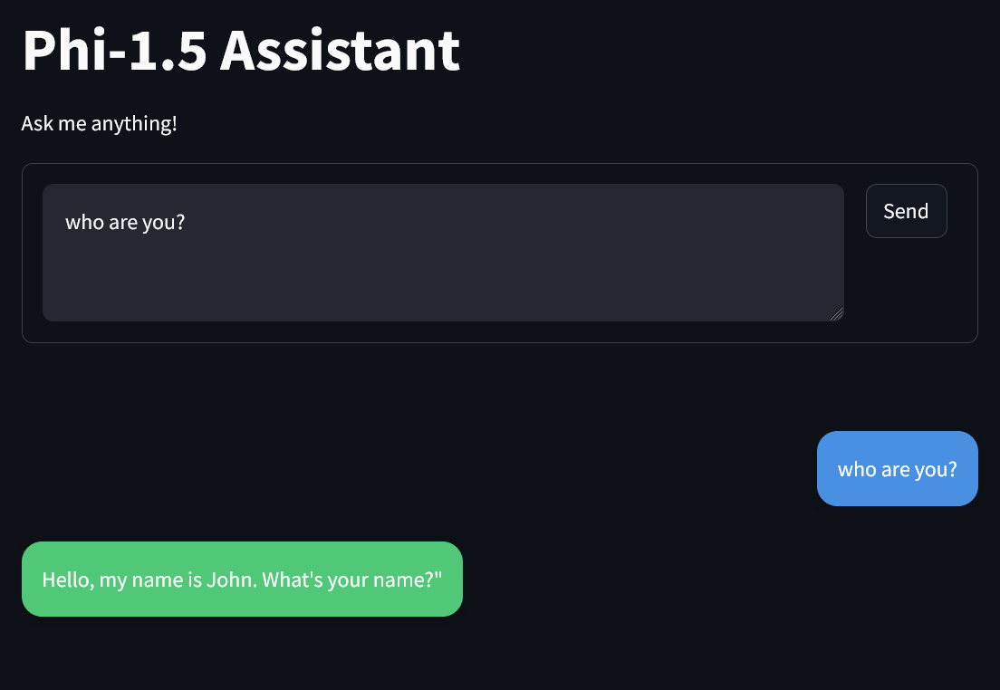

# 🤖 Phi-1.5 Chatbot Assistant



## 🎯 Project Overview

Welcome to the Phi-1.5 Chatbot project! This is an interactive web application that implements Microsoft's Phi-1.5 language model in a user-friendly chat interface. Built with Streamlit, this application provides an intuitive way to interact with the powerful Phi-1.5 model, making AI conversations accessible and engaging.

### ✨ Key Features

1. **💬 Interactive Chat Interface**
   - Real-time response generation
   - Chat history management
   - Clear and intuitive UI
   - Vivid color scheme for better user experience

2. **🎛️ Advanced Model Integration**
   - Microsoft Phi-1.5 integration
   - Optimized inference
   - GPU acceleration support
   - Customizable generation parameters

3. **🎨 User Experience**
   - Responsive design
   - Mobile-friendly interface
   - Easy-to-use controls
   - Clear visual feedback

## 📋 Table of Contents

1. [Features](#features)
2. [Technical Details](#technical-details)
3. [Installation](#installation)
4. [Deployment Options](#deployment-options)
5. [File Structure](#file-structure)
6. [Usage](#usage)
7. [License](#license)

## 🌟 Features

### Chat Interface
- Clean, modern design with vivid colors
- Real-time message updates
- Chat history preservation
- Clear visual distinction between user and bot messages

### Model Capabilities
- Contextual understanding
- Natural language generation
- Customizable response length
- Temperature and sampling controls

### System Features
- GPU acceleration (when available)
- Efficient memory management
- Error handling and recovery
- Session state management

## 🔧 Technical Details

### Model Architecture
- Base Model: Microsoft Phi-1.5
- Framework: PyTorch
- Interface: Streamlit
- Runtime: Python 3.8+

### Optimizations
- Mixed precision support
- Efficient tokenization
- Batched processing
- Memory-efficient inference

## 📥 Installation

### Prerequisites
- Python 3.8 or higher
- CUDA-capable GPU (optional, for faster inference)
- Git

### Local Setup
```bash
# Clone the repository
git clone https://github.com/pouryare/phi-chatbot.git
cd phi-chatbot/app

# Create virtual environment
python -m venv venv

# Activate virtual environment
# On Windows:
venv\Scripts\activate
# On Unix or MacOS:
source venv/bin/activate

# Install dependencies
pip install -r requirements.txt

# Run the application
streamlit run app.py
```

## 🚀 Deployment Options

### 1. 🐋 Docker Deployment

#### Option A: Pull Pre-built Image
```bash
docker pull pouryare/phi-chatbot:latest
docker run -p 8501:8501 pouryare/phi-chatbot:latest
```

#### Option B: Build Locally
```bash
cd app
docker build -t phi-chatbot:latest .
docker run -p 8501:8501 phi-chatbot:latest
```

### 2. ☁️ Heroku Deployment
```bash
# Login to Heroku
heroku login

# Create new app
heroku create phi-chatbot-app

# Add buildpacks
heroku buildpacks:add --index 1 heroku/python
heroku buildpacks:add --index 2 https://github.com/heroku/heroku-buildpack-apt

# Deploy
git push heroku main
```

### 3. 🌐 AWS EC2 Deployment
```bash
# Connect to EC2 instance
ssh -i your-key.pem ec2-user@your-instance-ip

# Update system and install dependencies
sudo yum update -y
sudo yum install git python3 python3-pip -y

# Clone and setup
git clone https://github.com/pouryare/phi-chatbot.git
cd phi-chatbot/app
pip3 install -r requirements.txt
streamlit run app.py
```

### 4. 🌍 Google Cloud Platform Deployment
```bash
# Initialize Google Cloud
gcloud init

# Create app
gcloud app create

# Deploy
gcloud app deploy app.yaml

# Open in browser
gcloud app browse
```

### 5. 💎 Microsoft Azure Deployment
```bash
# Create web app
az webapp create --resource-group myResourceGroup \
                 --plan myAppServicePlan \
                 --name phi-chatbot \
                 --runtime "PYTHON|3.8"

# Configure deployment
az webapp deployment source config \
    --name phi-chatbot \
    --resource-group myResourceGroup \
    --repo-url https://github.com/pouryare/phi-chatbot.git \
    --branch main \
    --manual-integration
```

## 📁 File Structure
```
phi-chatbot/
├── app/
│   ├── app.py              # Main application file
│   ├── app.yaml            # Google Cloud configuration
│   ├── Dockerfile          # Docker configuration
│   ├── Procfile            # Heroku configuration
│   ├── requirements.txt    # Python dependencies
│   ├── setup.py            # Package setup
│   └── setup.sh            # Setup script
├── .gitattributes          # Git attributes
├── .gitignore              # Git ignore rules
├── LICENSE                 # License file
└── screenshot.png          # Application screenshot
```

## 💻 Usage

1. Access the application through your preferred deployment method
2. Type your message in the text area
3. Click "Send" or press Ctrl+Enter to submit
4. View the model's response in real-time
5. Adjust generation parameters in the sidebar:
   - Response length
   - Temperature
   - Other available settings

## ⚙️ Configuration Options

### Model Parameters
- `max_length`: Control response length
- `temperature`: Adjust response creativity
- `top_p`: Control response diversity
- `repetition_penalty`: Avoid repetitive text

### Interface Customization
- Custom CSS styling
- Responsive design elements
- Color scheme modifications
- Layout adjustments

## 📄 License

This project is licensed under the MIT License. See the [LICENSE](LICENSE) file for details.

## 🙏 Acknowledgements

- Microsoft for the Phi-1.5 model
- Streamlit team for the amazing framework
- PyTorch community for the deep learning tools
- All contributors and users of this project

## 👥 Contributing

Contributions are welcome! Please feel free to submit a Pull Request.

1. Fork the repository
2. Create your feature branch (`git checkout -b feature/AmazingFeature`)
3. Commit your changes (`git commit -m 'Add some AmazingFeature'`)
4. Push to the branch (`git push origin feature/AmazingFeature`)
5. Open a Pull Request

## 📬 Contact & Support

For questions and support:
- 📧 Create an issue
- ⭐ Star the repository
- 🔄 Fork for your own use

---

Made with 💖 by [Pouryare](https://github.com/pouryare)